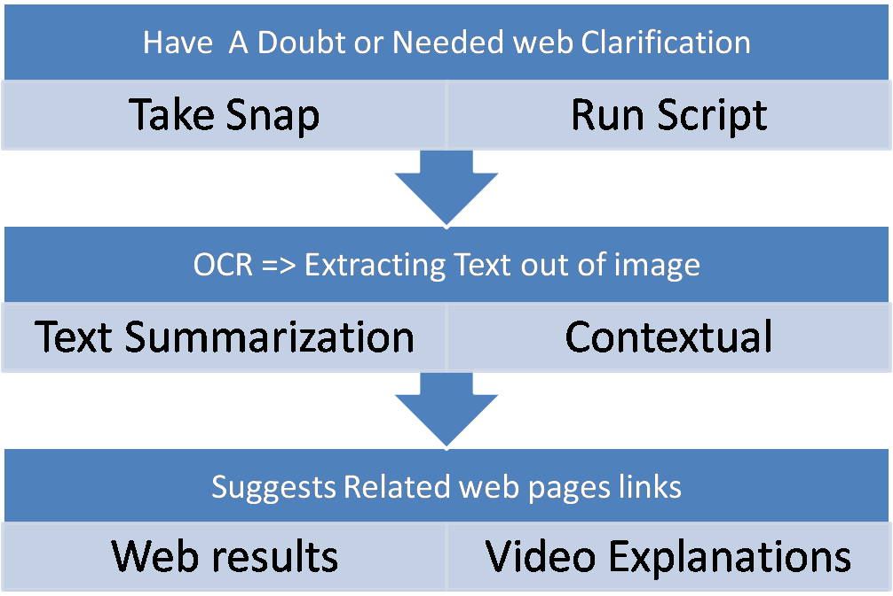

# Study-Companion

## Main Idea
**Study Companion** helps you get instant web resources and video explanations for any question or problem—just by taking a screenshot or uploading an image. The app extracts text from your image, summarizes it, and fetches the most relevant web pages and YouTube videos to clarify your doubts.

## How It Works
1. **Have a Doubt or Need Clarification?**
2. **Take a Screenshot/Snap** of the question or problem.
3. **Upload the Image** (or paste the text) in the web app.
4. The app performs **OCR** to extract text from the image.
5. **Text Summarization** distills the main point.
6. The app suggests **related web pages** and **video explanations**.



---

## Features
- Upload a screenshot or image of any question/problem
- Extracts text using OCR (OCR.space API)
- Summarizes the extracted or pasted text (NLP)
- Fetches relevant web links and YouTube videos
- Clean, modern web interface (Flask)
- Also supports direct text input

## Installation
1. Clone this repository
2. Install dependencies:
   ```bash
   pip install -r requirements.txt
   ```

## Usage
1. Start the web app:
   ```bash
   python app.py
   ```
2. Open [http://127.0.0.1:5000](http://127.0.0.1:5000) in your browser
3. **Upload a screenshot/image** OR **paste your text**
4. Get extracted text, summary, and instant web/video resources

## Example


---

## Legacy Workflow
This project also contains scripts for OCR and web search. See `main.py` and the flowchart below for the original command-line workflow.


